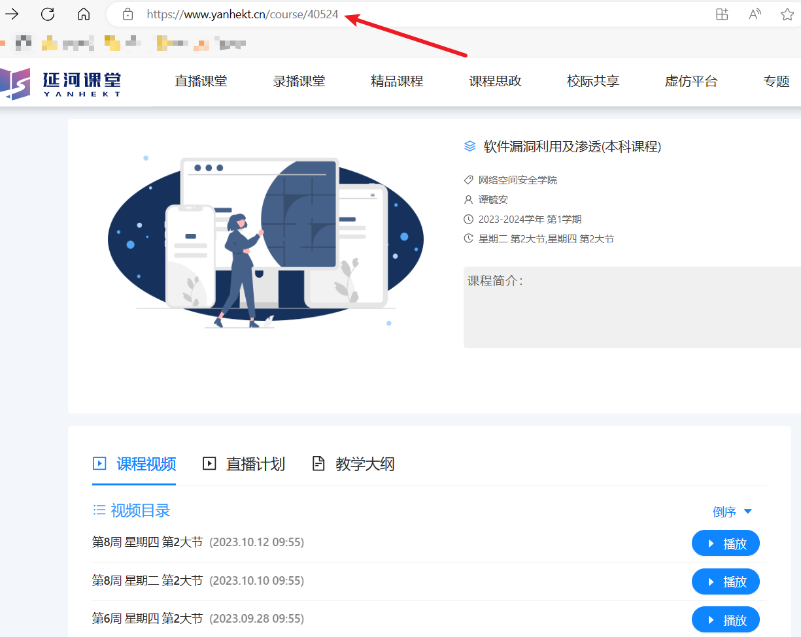
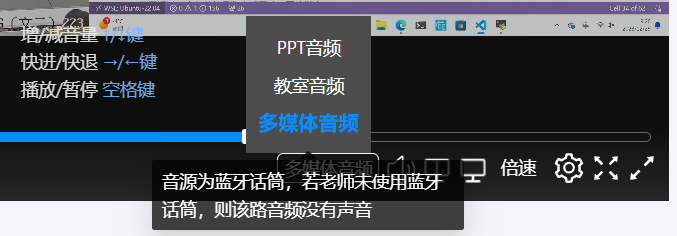
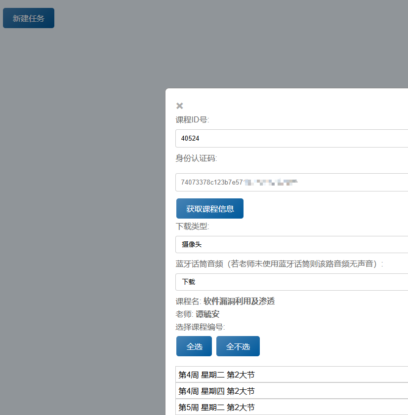
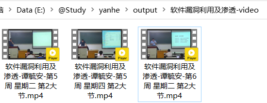
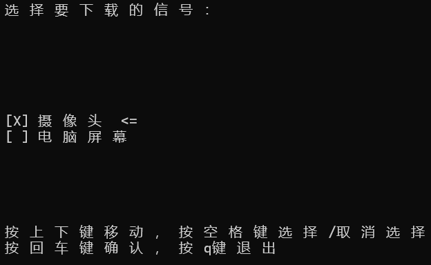
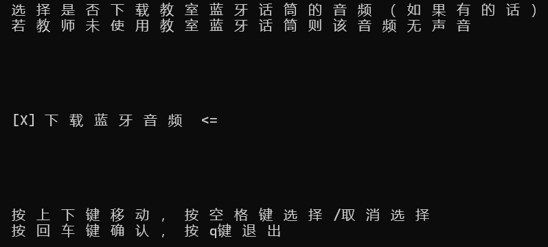

# BIT_yanhe_download

## 介绍

本项目可下载[延河课堂 (yanhekt.cn)](https://www.yanhekt.cn/recordCourse)中的课程视频。延河课堂是北京理工大学的在线课堂，提供了大量的课程视频，但是没有提供下载功能。本项目可以下载指定课程的摄像头和屏幕信号，包括无权限的课程。

欢迎提出建议和star！

## 使用：下载指定课程

[点击此处下载](https://github.com/AuYang261/BIT_yanhe_download/releases/latest/download/release_downloader.zip)并解压。

在[延河课堂 (yanhekt.cn)](https://www.yanhekt.cn/recordCourse)中找到想下载的课程，以链接为https://www.yanhekt.cn/course/40524 的课程为例，复制地址栏最后的五位编号40524。注意是课程列表的链接（以`yanhekt.cn/course/五位编号`开头），不是视频界面的链接（以`yanhekt.cn/session/六位编号`开头）。



### 登陆延河课堂

新版的延河课堂要求登陆才能查看课程列表，故需要先自行登陆延河课堂。登陆后，在延河课堂的页面的地址栏输入如下代码（注意，浏览器会自动去掉前缀"javascript:"，故直接复制粘贴后需手动补上）：

```
javascript:alert(JSON.parse(localStorage.auth).token)
```


回车后会弹出提示框，复制该身份认证码。


或者可以按`F12`键打开”控制台“，在其中输入上述代码，也能得到身份认证码。

### 网页GUI交互

双击运行`webui_interface.exe`文件打开网页服务器，会自动弹出浏览器网页。

而后在打开的网页中新建任务即可。

下载类型可选摄像头（即教室后的摄像头录像）或电脑屏幕（即教室电脑的屏幕信号）。

可以选择是否下载教室蓝牙话筒信号（该课程有蓝牙话筒信号时有效），若老师未使用蓝牙话筒则该信号没有声音。



首次使用或之前的登陆失效时，需要输入上述获取的身份认证码。

若之前使用过本工具（包括其他交互方式），登陆未失效，身份认证码会自动保存，无需每次都填写。



下载完成的文件在`output/`目录下以`课程名-video/screen`格式命名的文件夹中。若下载了蓝牙音频则保存在和视频同目录同名的`.aac`文件中。



### 命令行GUI交互

打开命令行（在`release_downloader.zip`解压的文件夹地址栏中搜索cmd），在命令行中输入`gui.exe`文件运行。直接双击运行可能会有字符对不齐的问题，导致难以识别文字。最好将命令行窗口最大化以免字符显示不全。


首先输入你想下载的课程编号(40524)，回车（小键盘的回车似乎不能用），获取课程视频列表：


同样，首次使用或之前的登陆失效时，需要输入上述获取的身份认证码；登陆未失效则不用。


按键盘上下键移动光标，按空格选择/取消选择，至少需要选择一个视频。选择完成后按回车确认。若想退出按q键即可。

确认后，选择要下载的信号，同样至少需要选择一个信号，选择完成后按回车确认。




而后选择是否下载教室蓝牙话筒信号，选择完成后按回车确认。开始下载。按`ctrl+c`停止。




### 原始交互方式

若使用上述GUI显示有问题，可直接使用原始交互方式。双击运行`main.exe`文件，并输入你想下载的课程编号(40524)和身份认证码（如果需要）。输出课程视频列表：


输入想下载的视频编号，用英文逗号(,)分隔，回车。接着输入数字选择下载摄像头信号还是下载屏幕信号，默认为摄像头信号。而后选择是否下载蓝牙话筒信号。回车即开始下载。

## 自动生成字幕

本项目提供自动生成字幕功能，使用openai的[whisper](https://github.com/openai/whisper)项目及其模型在本地进行语音转文字生成字幕。

最好使用GPU运行，否则速度较慢，依赖见[下文](#依赖)。

下载[字幕生成程序gen_caption](https://github.com/AuYang261/BIT_yanhe_download/releases/latest)，由于程序比较大，采用了分卷压缩发布。全部下载并解压，得到一个`gen_caption.exe`可执行文件，保存在上述`release_downloader.zip`解压的目录中，和保存视频的目录`output/`同级，如下所示：


下载完视频后，双击运行`gen_caption.exe`（文件较大，需要等一会），输入数字选择视频，回车。再输入数字选择使用多大的模型，越往下效果越好，但所需时间也越长，默认使用base模型。第一次使用会自动下载模型（几百M），请耐心等待。如下所示：


等待程序运行完成，生成的字幕文件为`.srt`格式，与视频文件在同级目录下，用支持字幕的播放器（如potplayer）打开视频即可看到带字幕的视频。

*tips: 语音转文字所需的时间较长，可以先观看视频，字幕生成好了再重新打开视频享受字幕。使用GPU大约需要几分钟，不使用GPU则需要更长时间。*

## 依赖

* ffmpeg，已在Release中提供。若在Linux环境下运行，需手动安装ffmpeg：

```bash
sudo apt update
sudo apt install ffmpeg
```

* **若使用GPU运行自动生成字幕功能，需要先安装cuda，安装方法见[cuda安装](https://blog.csdn.net/chen565884393/article/details/127905428)。**

*若想用python环境运行，需安装以下依赖*

* python，[下载](https://www.python.org/ftp/python/3.9.4/python-3.9.4-amd64.exe)并安装

* python第三方库requests。打开命令行，运行如下命令安装：

```bash
pip install -r requirements.txt -i https://pypi.tuna.tsinghua.edu.cn/simple
```

* 安装语音转文字的依赖：（依赖于pytorch，若未安装pytorch，会自动安装，但是cpu版本。安装cuda版本的pytorch方法见[pytorch官网](https://pytorch.org/get-started/locally/)。）

```bash
pip install -r requirements_whisper.txt -i https://pypi.tuna.tsinghua.edu.cn/simple
```

## 注意

* 需要关闭本机上的代理，否则会提示类似`check_hostname requires server_hostname`的报错信息。
* 可以下载无权限的课程，只要知道课程链接（中的课程编号）就行。

## 打包（仅开发者需要）

如果想要运行时不依赖python环境，可将python程序打包成可执行文件。Release中已打包。

使用如下命令打包：

```bash
# 若未安装pyinstaller，运行以下命令安装
pip install pyinstaller
# 打包
pyinstaller -F main.py
pyinstaller -F gui.py
pyinstaller -F webui_interface.py --add-data webui:webui --add-data templates:templates
pyinstaller -F gen_caption.py
```
打包`gen_caption.py`时可能会失败，提示递归过深：


解决方法参考[这里](https://zhuanlan.zhihu.com/p/661325305)，需要修改项目根目录下的`gen_caption.spec`配置文件，在文件开始处加上以下代码：

```python
import sys ; sys.setrecursionlimit(sys.getrecursionlimit() * 5)
```

再使用如下命令打包：

```bash
pyinstaller --clean .\gen_caption.spec
```

打包完成后运行若出现Temp目录下的文件未找到：


解决方法参考[这个](https://blog.csdn.net/qq_42324086/article/details/118280341)，将项目`hooks`目录下的`hook-whisper.py`和`hook-zhconv.py`文件复制到pyinstaller的hook目录下（通常在`python根目录\Lib\site-packages\PyInstaller\hooks`）。
